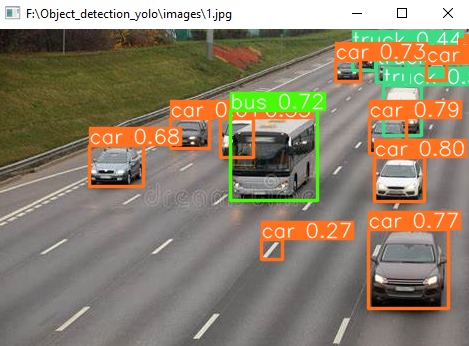
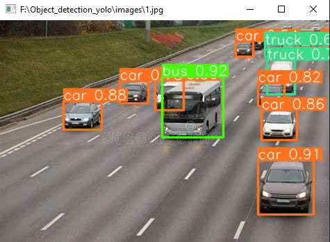

Object detection models Using Yolo and CV
This models contain some projects such as:

1. YOLO-Basics 

This model for image detection 

2. Yolo-Webcam project

This project is detecting items using webcam

I will modify on the same code to detect items from recorded video 
 
     

Running Yolo with GPUs

Make docker file for the pytorch 
To run it :
docker build -t object_detection_yolo .
docker run --gpus all -it object_detection_yolo

3. Car Counter project
create mask and ensure its has the same size (1280*720) pixcel
## Car Counter Demo  

4. People counter project:

5. personal protective detector Project:

